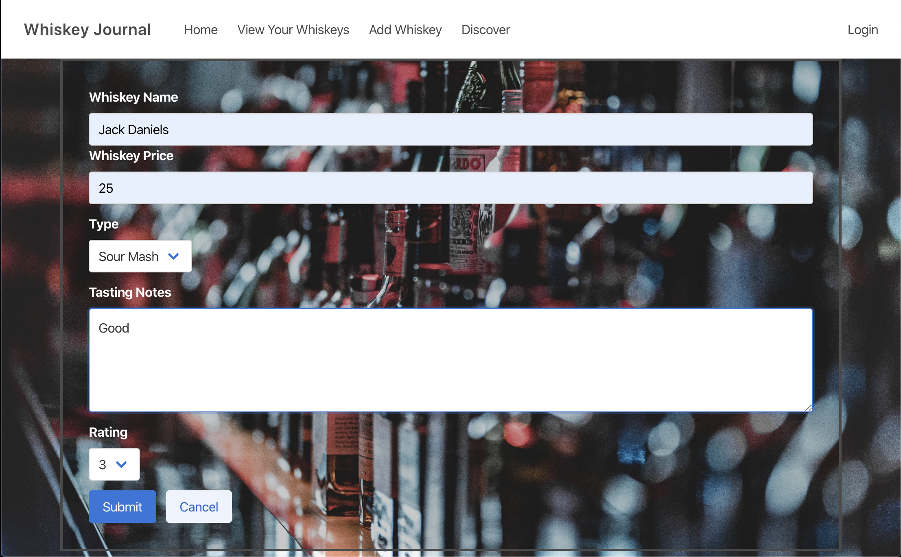
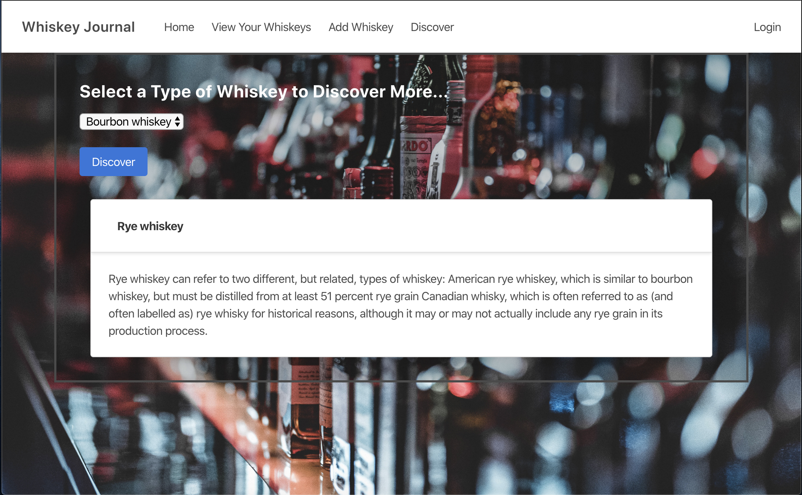

# whiskey-journal
A responsive whiskey journal using a mysql database on the backend to log tasting notes.

# Visuals
## Home
A landing page for the site

## View Your Whiskeys
View the reviewed whiskeys.  Sort the list by clicking on the table heading.

## Add Whiskey
Add a whiskey with tasting notes.

## Discover
Select a whiskey topic to discover more.

# Usage

1. Navigate to https://whiskey-journal.herokuapp.com/
2. From the landing page select Add Whiskey to log a whiskey with tasting notes.
3. Use the View Your Whiskeys page to read whiskey reviews
4. The Discover page provides information on different kinds of whiskeys.

# What We Learned

* SQL queries for Create, Read, Update, and Delete (CRUD)
* HTML templating with handlebars
* Bulma CSS framework

# Links to Project

##### GitHub
[whiskey-journal](https://github.com/eric-gustafson1/whiskey-journal)

##### Heroku
[whiskey-journal](https://whiskey-journal.herokuapp.com/)
